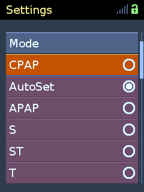
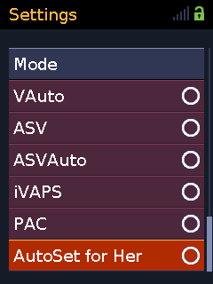
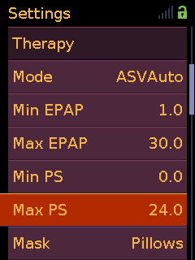
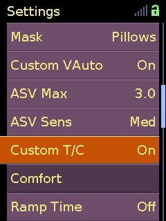
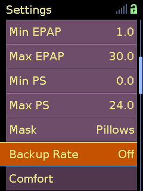
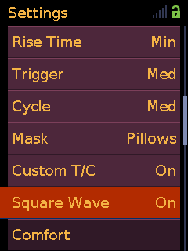
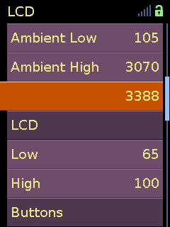

# airbreak-plus

Firmware modification toolkit for ResMed AirSense and AirCurve devices.

| Platform | Guide |
|----------|-------|
| AirSense 10 / AirCurve 10 | [Air10 Quickstart](docs/guide/quickstart.md) |
| AirSense 11 / AirCurve 11 | [Air11 Quickstart](docs/guide/as11/quickstart.md) |
| Series 9 | Partial support; no maintained guide |

## What it does

### Air10

- [Unlocks all therapy modes](docs/guide/features/general.md#all-therapy-modes)
- [Unlocks clinical settings menu with full pressure range](docs/guide/features/general.md#clinical-settings-and-pressure-range)
- [Removes motor runtime hours nag screen](docs/guide/features/general.md#motor-runtime-warning)
- [Expands EDF recording across unlocked therapy modes](docs/guide/features/general.md#edf-recording)
- [Maintains myAir cloud compatibility across therapy modes](docs/guide/features/general.md#myair-cloud-compatibility)
- [Custom VAuto pressure support](docs/guide/features/custom_vauto.md) in the VAuto slot
- [Runtime ASV and ASVAuto backup-rate control](docs/guide/features/asv_backup_rate.md)
- [Selectable Square Wave pressure shaping](docs/guide/features/squarewave.md) for S, ST, T, and PAC
- [Continuous LCD and button brightness adaptation](docs/guide/features/backlight.md)
- [ILI9325/ILI9328 LCD driver](docs/guide/features/general.md#replacement-lcd-driver) (the most common replacement panel available for these devices)

  
  
  
  
  
  
  

Best support for SX567-0401 and SX567-0402 firmware. Other versions are handled with reduced feature coverage.

### Air11

- [Unlocks supported therapy modes and related clinical settings](docs/guide/as11/features.md#supported-therapy-modes)
- [Allows custom ASV and ASVAuto pressure-support ranges](docs/guide/as11/features.md#asv-pressure-support-range)
- [Expands EDF recording across unlocked therapy modes](docs/guide/as11/features.md#edf-recording)
- [Keeps EDF and myAir variant reporting aligned with the selected mode](docs/guide/as11/features.md#variant-reporting)
- [Unlocks configured languages and selected firmware defaults](docs/guide/as11/features.md#languages-and-defaults)
- [Removes the design-life warning triggered after ~20,000 hours of runtime](docs/guide/as11/features.md#device-design-life-message)

## Getting started

Windows users can prepare the common build environment with the
[WSL2 setup guide](docs/guide/wsl_setup.md).

| Guide | Air10 | Air11 |
|-------|-------|-------|
| Quickstart | [Air10 Quickstart](docs/guide/quickstart.md) | [Air11 Quickstart](docs/guide/as11/quickstart.md) |
| Disassembly | [Air10 disassembly](docs/guide/disassembly.md) | [Air11 disassembly](docs/guide/as11/disassembly.md) |
| Connections | [SWD wiring](docs/guide/wiring.md) or [serial connection](docs/guide/serial_connection.md) | [SWD or CAN connection](docs/guide/as11/connection.md) |
| Firmware dump | [OpenOCD](docs/guide/openocd.md) | [OpenOCD](docs/guide/as11/openocd.md) |
| Patching | [Air10 patching](docs/guide/patching.md) | [Air11 patching](docs/guide/as11/patching.md) |
| Flashing | [Air10 flashing](docs/guide/flashing.md) | [Air11 flashing](docs/guide/as11/flashing.md) |

## Reference

### Air10

| Document | Content |
|----------|---------|
| [resmed_config](docs/tools/resmed_config.md) | UART configuration tool |
| [resmed_flash](docs/tools/resmed_flash.md) | UART firmware flash and dump tool |
| [Config variables](docs/config_variables.md) | Firmware variable system and globals[] structures |
| [Variable reference](docs/var_reference.tsv) | Firmware variables with var_id, UART name, EDF signal |
| [Patching: Custom settings](docs/custom_settings.md) | Variable assignments, reclaimed resources, persistence, and menu registry |
| [Patching: Patch payloads](docs/patch_payloads.md) | Versioned payload build, code-cave allocation, stubs, and ABI slots |
| [eeprom_tool](docs/tools/eeprom_tool.md) | SPI EEPROM access (deprecated, see [native support](https://github.com/m-kozlowski/airbreak-plus/blob/master/docs/tools/resmed_config.md#calibration-eeprom)) |
| [UART protocol](docs/serial_protocol.md) | Frame format and commands |
| [oximeter protocol](docs/oximeter_protocol.md) | Oximetry data submission specification |

### Air11

| Document | Content |
|----------|---------|
| [as11_config](docs/tools/as11_config.md) | Configuration, RPC, streams, events, spools, and BLE pairing |
| [as11_flash](docs/tools/as11_flash.md) | CAN and BLE firmware flashing |
| [CONF block format](docs/as11/conf_block_format.md) | Descriptor and schema structures |
| [Variable reference](docs/as11/var_reference.tsv) | Cross-version variable names and metadata |
| [as11_descriptors](docs/tools/as11_descriptors.md) | Offline firmware and CONF inspection |
| [Patching: Patch payloads](docs/as11/patch_payloads.md) | Versioned payload builds, code-cave allocation, native stubs, and callback integration |
| [CAN connection](docs/as11/can_connection.md) | Connectors, wiring, and tested adapters |
| [CAN protocol](docs/as11/can_protocol.md) | CAN datagrams, VCIDs, and service endpoints |
| [Bluetooth protocol](docs/as11/bluetooth_protocol.md) | BLE pairing, session, and transport |
| [RPC protocol](docs/as11/rpc_protocol.md) | JSON-RPC methods and message transport |
| [OTA protocol](docs/as11/ota_protocol.md) | Upgrade containers, authentication, and targets |
| [EDF signals](docs/as11/edf_signals.md) | Air11 EDF file and signal schemas |

## Related

- [airbridge](https://github.com/m-kozlowski/airbridge) - ESP32 WiFi bridge for AirSense 10 service port
- [aircannect](https://github.com/m-kozlowski/aircannect) - Wireless adapter for AirSense/AirCurve 11 devices
