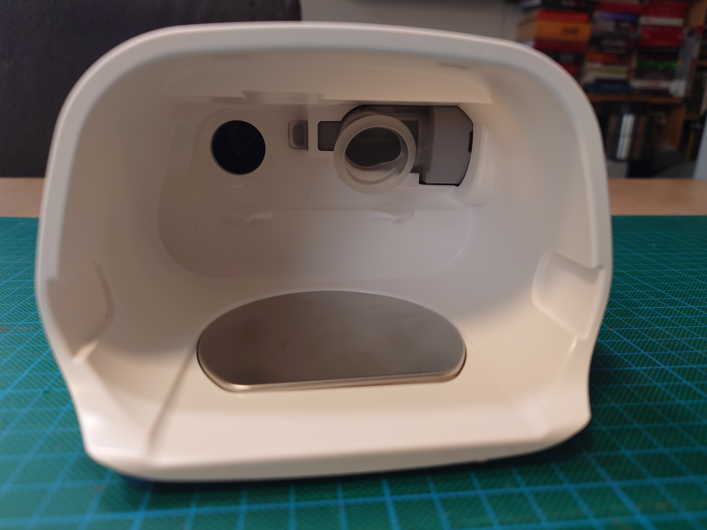
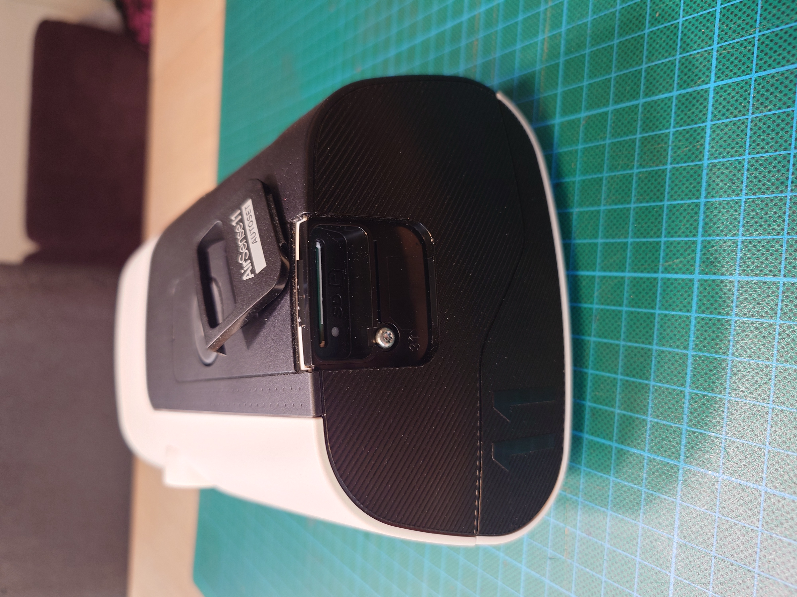
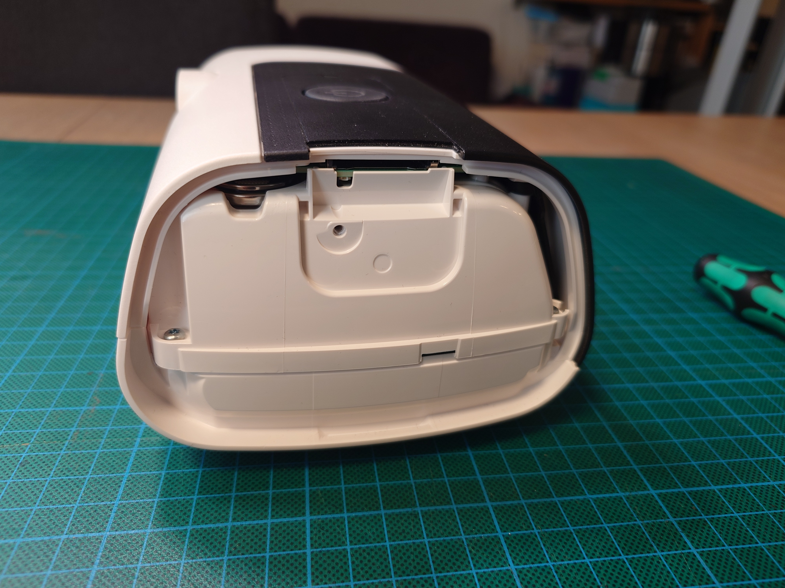
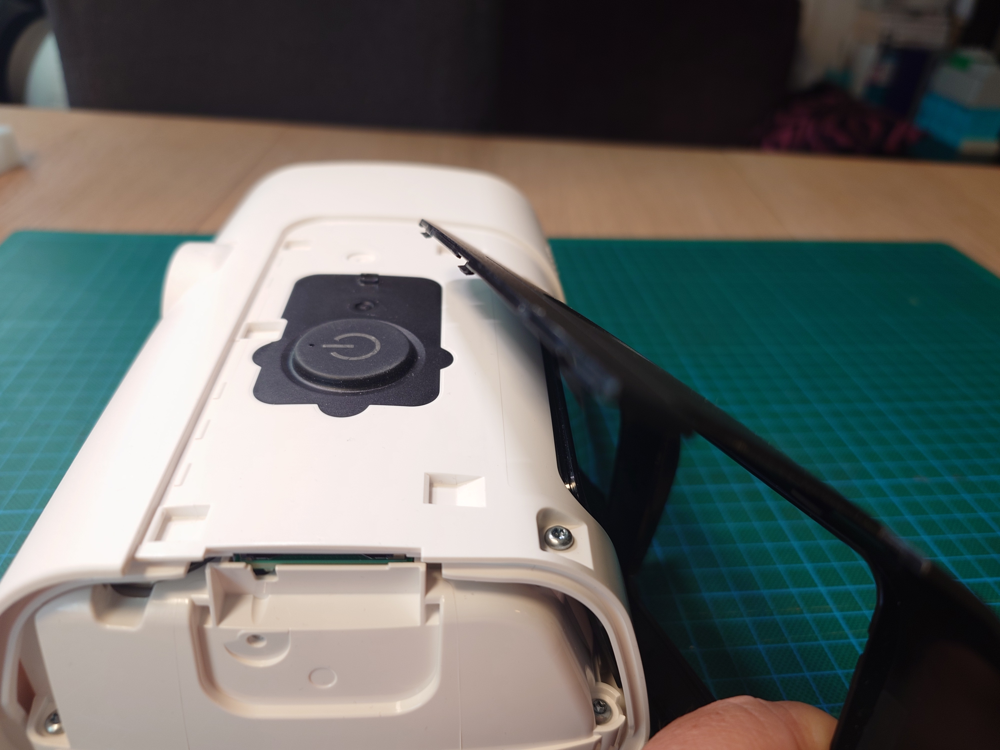
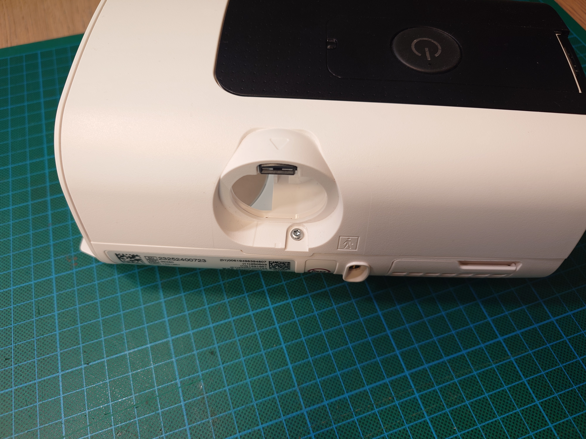
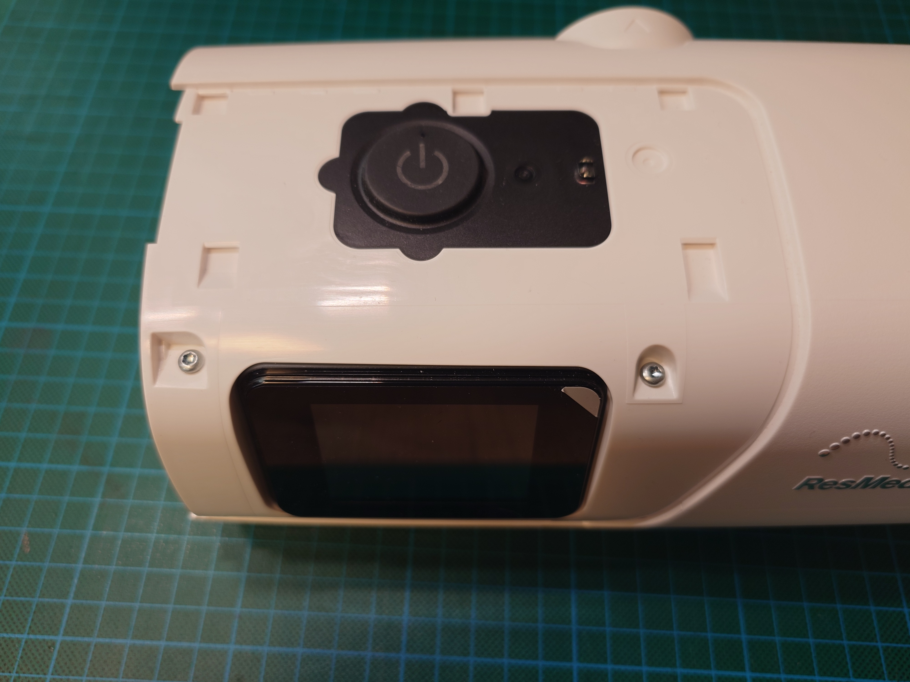
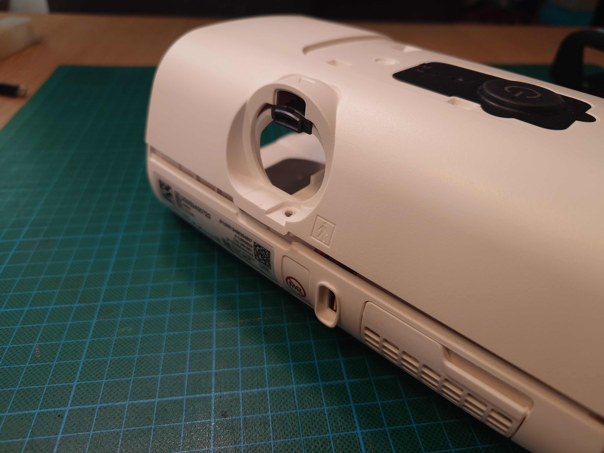
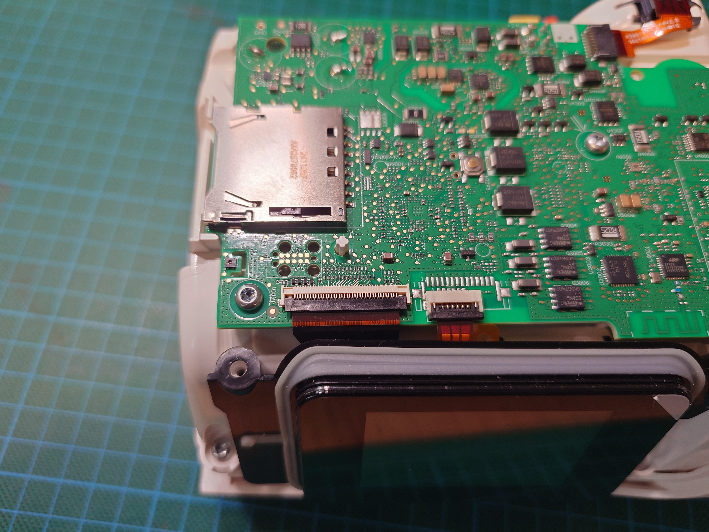

# Air11 Disassembly

Opening an AirSense 11 or AirCurve 11 to reach the SWD programming footprint.

## Tools

- Torx T10 screwdriver for the case screws
- thin plastic pry tool or spudger

## Steps

### 1. Remove the air outlet

Remove the air outlet from the rear of the device.

### 2. Remove the SD cover

At the SD-card slot, lift the black cover from the upper edge and unclip it
from the side panel.

### 3. Remove the side cover

Remove the screw exposed under the SD cover, then pull off the side cover.

### 4. Remove the top faceplate

Gently lift the upper edge of the black top faceplate, then pull the faceplate forward.

### 5. Remove the top-cover screws

Remove the rear top-cover screw from the air-outlet recess.

Remove the two front top-cover screws beside the LCD.

### 6. Remove the top cover

Pull the rear of the top cover slightly backward and upward, then lift the top
cover away from the device.

### 7. Locate the TC2050 footprint

The TC2050 footprint is on the main board near the SD-card socket and LCD
ribbon connector. The board does not need to be removed for normal SWD access.

## Reassembly

Reverse the steps. Seat the top cover before tightening the three top-cover
screws, then reinstall the faceplate, side cover, SD cover, and air outlet.

Once the programming footprint is accessible, continue with
[Connection](connection.md#swd).
