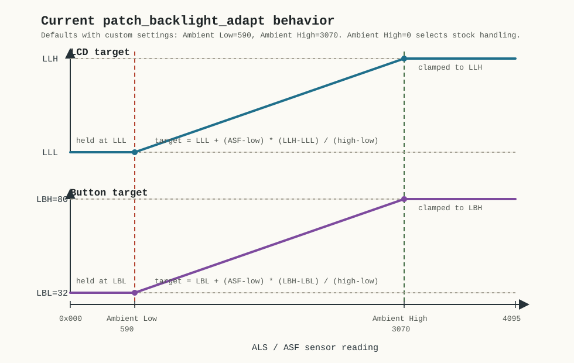

# Backlight Adaptation

The backlight patch continuously maps the filtered ambient-light reading to LCD
and button brightness while the display is in its steady on state. Stock
firmware remains responsible for wake, timeout, dim, off, and other transition
states.

## Inputs

| Variable | Menu name | Function |
|----------|-----------|----------|
| ASF | -- | filtered ambient-light sensor value |
| ATH | Ambient Low | sensor value where the linear brightness range starts |
| RCF | Ambient High | sensor value where the linear brightness range reaches its high endpoint |
| LLL | -- | LCD brightness at Ambient Low |
| LLH | -- | LCD brightness at Ambient High |
| LBL | -- | button brightness at Ambient Low |
| LBH | -- | button brightness at Ambient High |

Ambient Low remains the firmware ATH variable in its stock NGL persistence
group. Ambient High reuses RCF and is stored with the other custom values in
`CSG.set`.

## Brightness mapping

| Ambient reading | LCD target | Button target |
|-----------------|------------|---------------|
| ASF at or below Ambient Low | LLL | LBL |
| between Ambient Low and Ambient High | linear interpolation from LLL to LLH | linear interpolation from LBL to LBH |
| ASF at or above Ambient High | LLH | LBH |

The patch applies a small deadband to LCD target changes and advances brightness
gradually. It also preserves a hysteresis region around Ambient Low so small
sensor changes do not repeatedly switch the low-light state.

When stock firmware enters a non-steady transition, the patch calls the stock
state machine. Ambient control resumes after a short cooldown to avoid fighting
the end of the stock transition.

## Settings

Both settings appear in the clinical Configuration section for every therapy
mode.

| Setting | Range | Step | Default |
|---------|-------|------|---------|
| Ambient Low | 0 to 4090 | 5 | 590 |
| Ambient High | 0 to 4090 | 10 | 3070 |

Ambient High should normally be greater than Ambient Low. If it is equal or
lower, the interpolated range collapses and brightness changes directly from
the low endpoint to the high endpoint after Ambient Low.

Setting Ambient High to zero restores stock backlight behavior. The patched
default values and ambient-light averaging remain in effect.

## Behavior without custom settings

The backlight payload does not require the custom menu framework.

Without `custom_settings`:

- no Ambient Low or Ambient High menu entries are added
- stock Reminders remain available
- Ambient High uses the fixed fallback `0xC00`
- ATH still receives the patched default of 590
- LBL still receives the patched default of 32
- LBH still receives the patched default of 80
- LLL and LLH retain the firmware values loaded for the unit

Because no Ambient High variable is connected in this configuration, the zero
value stock-state-machine selection is not available through the menu.

## Related settings

Changing LLL, LLH, LBL, or LBH changes the brightness endpoints but does not
change the ambient thresholds. Changing Ambient Low or Ambient High changes the
sensor range but does not change endpoint brightness.

## Next

[Patching](../patching.md)
